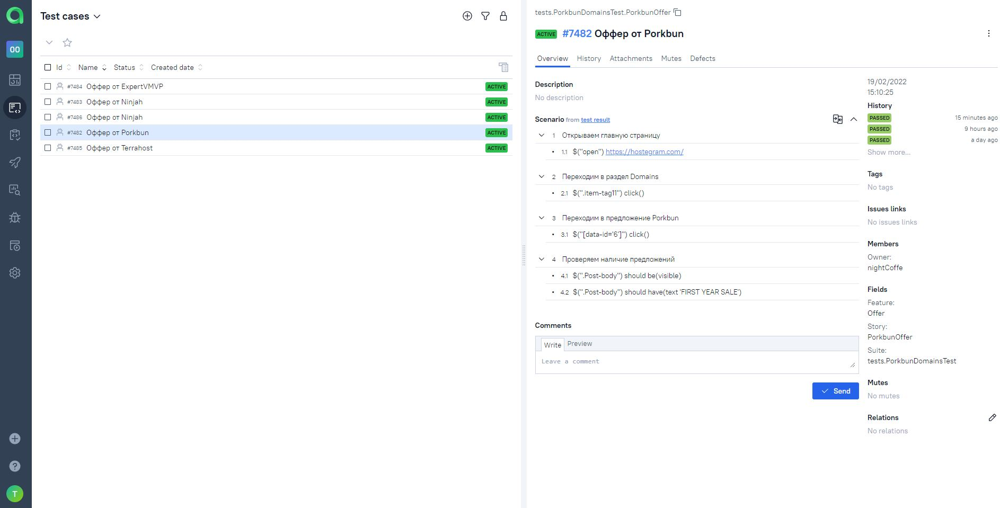

# webProject

The test automation project for [Hostegram website] https://hostegram.com/
<p align="center">
  
</p>


<p  align="center" p>

<code>


</code>
</p>

___

## Run tests from terminal locally

### Run tests with filled remote properties:

```bash
gradle clean test
```

### Run tests without filled remote properties:

```bash
gradle clean test

-Dbrowser=${BROWSER}
-DbrowserVersion=${BROWSER_VERSION}
-DbrowserSize=${BROWSER_SIZE}
```

### Serve report:

```bash
allure serve build/allure-results
```

___

## Results 

The test results can be found in:
+ [Jenkins](#jenkins)
+ [Allure Report](#allure-report)
+ [Allure TestOps](#allure-testOps)


### [Jenkins](https://jenkins.autotests.cloud/job/09-elenakomarova-itfinland-project-ui/build?delay=0sec)

For the running autotests in Jenkins, you can specify the parameters described
in :point_up:  [Run tests without filled remote properties](#run-tests-without-filled-remote-properties).


<p align="center">
  
</p>

Once the launch is finished you may watch statistics and open the `Allure Report` 

<p align="center">
  
</p>

### Allure Report

Here are the examples of a report about test build with grouping by tags (:point_up: [The list of tests grouped by tag parameter](#the-list-of-tests-grouped-by-tag-parameter))

:arrow_right: [The launch with results for tag = main_page](https://jenkins.autotests.cloud/job/09-elenakomarova-itfinland-project-ui/93/allure/)

<p align="center">
  
</p>

:arrow_right: [The launch with results for tag = top_menu](https://jenkins.autotests.cloud/job/09-elenakomarova-itfinland-project-ui/94/allure/)

<p align="center">
  
</p>

### Allure TestOps

Allure TestOps is used as a storage for all tests cases (automated and manual), launches, their results. You may watch statistic and reports by all launches and results

:arrow_right: Dashboards:

<p align="center">
  
</p>

<p align="center">
  
</p>

___

## Example of video with test running in Allure Report

You may see the example of a video showing the test run in Allure report.

<p align="center">
  
</p>


___

## Notifications in Telegram channel

The project is configured to send notifications about the results of launches from Jenkins to Telegram channel

<p align="center">
  
</p>

<p align="center">
  
</p>


___
